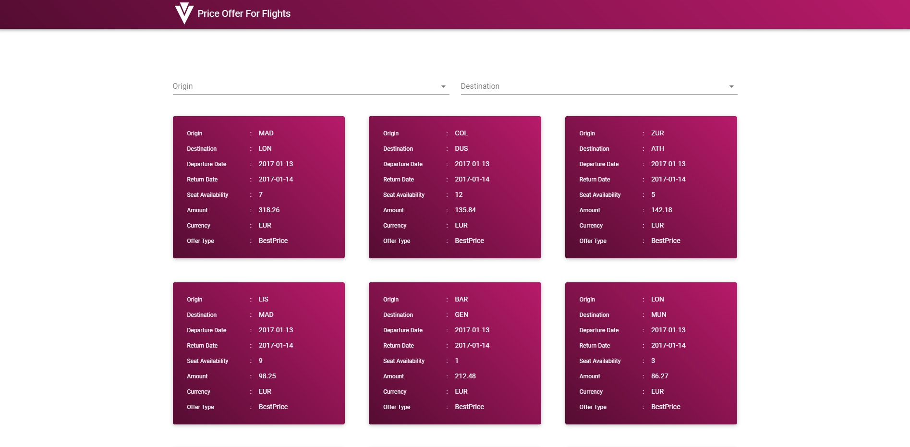

# Author - Hasan Colak

- [Github](https://github.com/hasancolak)
- [Linkedin](https://www.linkedin.com/in/hasan-colak-linkprofile/)
- [Medium](https://hasancolak.medium.com/)

# Vue Price Offers Application

This is a Simple Vue Price Offers application.

# Installation and Settup Instructions

In the project directory, you can run:

## Installation:

`npm install`

## To start a server:

`npm start`

## To visit the application:

Runs the app in the development mode.\
Open [http://localhost:8080](http://localhost:8080) to view it in the browser.

## To build the application:

`npm run build`

Builds the app for production to the `build` folder.\
It correctly bundles React in production mode and optimizes the build for the best performance.

## Usage and Screens:

# Guideline

## Project Structure

- src
  - asets
  - common
  - components
  - model
  - plugins
  - router
  - service
  - store
  - views
  - App.vue
  - main.js

## Tech Stack

- Vue
- Javascript
- Vuex
- Vuetify
- Sass

## API Reference

While starting the application, an API Server is also started with proxy.

## State Management Preferences

At this project, I have used Vuex with Vue for global state management

## Design Principle and Code Quality

The separation of concerns (SoC) is one of the most fundamental principles in software development.
